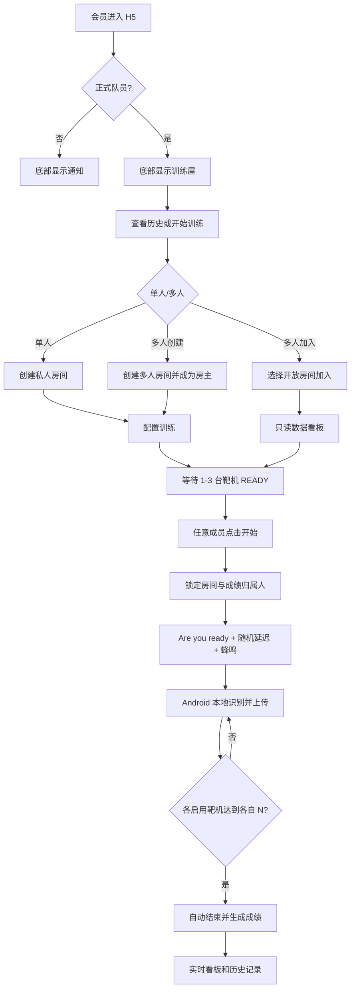
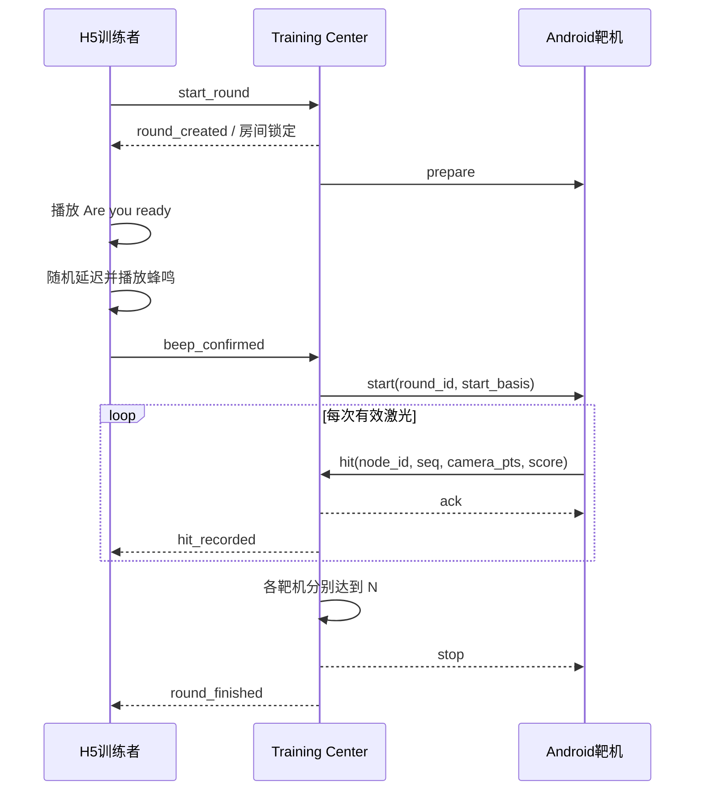

# 激光训练屋产品需求文档（PRD）

| 项目 | 内容 |
|---|---|
| 文档版本 | V1.0 |
| 产品阶段 | 第一阶段：产品需求评审 |
| 适用版本 | 训练屋 MVP |
| 目标终端 | H5 会员端、Android 靶机、Web 后管 |
| 服务端基线 | Spring Boot 微服务 + MySQL + WebSocket |
| 当前状态 | 待产品评审，未进入 UX 与开发 |

## 1. 文档目的

本文定义“激光训练屋”第一版的产品边界、用户流程、训练规则、页面状态、权限、数据指标、接口语义和验收标准。本文通过评审后，UX 才能制作三端可交互原型；原型再次确认后，开发团队才能修改正式业务代码。

本期将 Android 手机作为智能靶机节点：摄像头在设备本地识别靶纸及短时红色激光落点，计算命中结果后通过 WebSocket 上传。H5 是训练控制、实时看板和历史成绩的主要入口，后管用于房间、设备、模式、成绩及审计管理。

## 2. 产品目标与边界

### 2.1 产品目标

1. 正式队员可在现有 H5 中进入训练屋，完成单人或多人激光干火训练。
2. 支持最多 3 台 Android 靶机协同采集，训练数据实时归属到本轮启动者。
3. 首期支持“反应计时”和“精准训练”两种训练模式。
4. 自动保存完整训练结果与逐次命中数据，并提供个人历史与多人实时看板。
5. 管理员可管理房间、设备、训练模式和成绩，并对成绩变更保留审计记录。
6. Android 在网络短暂中断时持续检测，通过本地队列和序号机制恢复上传。

### 2.2 本期不实现

- 完整 IDPA Classifier、5×5 Classifier、Bill Drill、赛事 Stage 编排。
- IDPA Points Down、Penalty 和赛事最终计分。
- 打印靶 PDF 自动生成及打印管理。
- 视野外脱靶自动判断；第一版只统计摄像头识别到的有效上靶。
- 多名训练者在同一房间并发训练。
- 硬件扳机、专业 PTP 时钟同步和微秒级跨设备绝对同步。
- iOS 原生 App；iPhone 使用 H5。

## 3. 用户与权限

### 3.1 用户角色

| 角色 | 训练屋入口 | 核心能力 |
|---|---|---|
| 非正式队员 | 无，底部仍显示“通知” | 查看和处理现有通知 |
| 正式队员 | 有，底部“通知”替换为“训练屋” | 查看个人成绩、创建/加入房间、开始本人训练 |
| 多人房主 | 同正式队员 | 额外拥有房间设置、成员管理和关闭房间权限 |
| 多人加入者 | 同正式队员 | 仅查看数据看板，可在房间空闲时启动自己的训练 |
| 超级管理员/授权管理员 | 后管 | 管理房间、设备、模式、成绩和审计 |
| Android 靶机 | 使用正式队员账号登录 | 选择房间和靶机号，校准、识别并上传数据 |

### 3.2 权限原则

- H5 与 Android 的训练接口必须由服务端校验 `is_regular_member=1`，不能只依赖前端隐藏。
- 房主设置权限只属于房间创建人；普通成员不显示设置 Tab。
- 任意在房成员都可在房间空闲且靶机就绪时开始训练，成绩归点击开始者。
- 同一房间同一时刻只允许一个活动训练轮次。
- 管理员修改或删除成绩必须填写原因；操作进入不可由业务页面删除的审计记录。

## 4. 核心概念与状态

### 4.1 核心对象

- **训练房间**：成员和靶机协作容器，分单人房间与多人房间。
- **训练轮次**：一次从准备、蜂鸣、采集到自动结束的训练，唯一归属一名训练者。
- **靶机节点**：运行 Android App 的手机，在房间内占用 1、2 或 3 号靶机位。
- **命中事件**：靶机识别的一次有效激光落点，包含相机时间、坐标、环数和置信度。
- **训练结果**：轮次结束后由服务端聚合的时长、命中、分段、环数和精准度。

### 4.2 房间状态

| 状态 | 含义 | 可执行操作 |
|---|---|---|
| 等待设备 | 房间已创建，但启用靶机未全部 READY | 房主设置、设备加入、成员加入、关闭 |
| 空闲 | 所有启用靶机 READY，当前无活动轮次 | 任意成员开始训练 |
| 准备中 | 已锁定训练者，正在播放语音及等待蜂鸣 | 取消本轮；禁止其他人开始 |
| 训练中 | 蜂鸣已发出，正在接收命中 | 查看实时看板、异常停止 |
| 结算中 | 达到结束条件，正在聚合结果 | 只读，禁止开始下一轮 |
| 已关闭 | 房主或管理员关闭 | 只读历史，不可重新加入 |

### 4.3 靶机状态

离线、连接中、待选房、校准中、校准失败、READY、训练中、断线重连、待上传、已停用。靶机只有在连接正常、房间/编号有效且校准完成时才计为 READY。

## 5. H5 产品需求

### 5.1 导航分流

- 非正式队员底部保留“活动 / 发射器租赁 / 通知 / 我的”。
- 正式队员底部显示“活动 / 发射器租赁 / 训练屋 / 我的”，不再提供通知入口和未读角标。
- 用户身份发生变化后，下次拉取个人资料时刷新导航；当前页无权限时返回活动页。

### 5.2 训练屋首页

首页包括个人训练摘要、开始训练按钮、筛选条件和历史成绩列表。

历史列表摘要显示：训练时间、模式、单人/多人、训练时长、靶机数量、命中总数、核心结果。点击记录展开完整参数：

- 房间名称、训练者、训练模式、开始/结束时间、总时长。
- 每台靶机配置的 N、实际命中数、完成时间。
- 每次命中的靶机号、序号、Shot Time、Split、环数、精准度和置信度。
- 精准训练显示环数序列、总环数、平均环数、平均精准度。
- 反应计时显示各靶机第 N 次命中用时及整轮完成用时。

支持按模式和日期筛选；加载、空数据和错误状态必须有明确反馈。

### 5.3 开始训练

点击“开始训练”后选择：

1. **单人练习**：创建仅本人可见的临时房间，直接进入房间。设置与数据看板均对本人开放。
2. **多人练习**：选择“创建房间”或“加入房间”。
   - 创建房间：输入房间名称后创建并进入，本人成为房主。
   - 加入房间：展示开放、未满员的多人房间；显示房主、在线人数、房间状态和靶机就绪情况，选择后加入。

多人房间最多 10 人。已关闭、已满员或无权限房间不允许加入；训练中的房间可加入并观看，但不可开始新轮次。

### 5.4 房间页面

房主和单人房间显示“数据看板 / 设置”两个 Tab；多人加入者只显示数据看板，不渲染设置入口。

数据看板包括：

- 房间状态、当前训练者、模式、训练进度和启用靶机状态。
- 单人房间只显示本人数据。
- 多人房间提供“只看自己 / 查看全部”切换；全部视图按成员展示本房间历史轮次与当前轮次。
- 当前轮次实时展示每台靶机命中进度、逐次时间、Split、环数和精准度。
- 非当前训练者看到只读状态和“正在训练”提示。

设置包括：

- 模式：反应计时 / 精准训练。
- 启用靶机数量：1 至 3。
- 每台靶机分别设置目标 N，N 为正整数。
- Precision 靶纸：A4 或 A3。
- 语音和蜂鸣音量、最小随机延迟、最大随机延迟。
- 房间名称（多人）、成员列表、移除成员和关闭房间。

房间训练中不可修改影响当前轮次的设置。修改后的配置只作用于下一轮。

### 5.5 开始与自动结束

开始前必须满足：房间空闲、操作者仍在房间、所有启用靶机 READY、N 配置有效、浏览器音频已解锁。

流程：

1. 用户点击开始，服务端原子锁定房间并创建轮次，成绩归该用户。
2. H5 播放“Are you ready?”。
3. 在设置的最小与最大延迟间随机等待。
4. H5 播放蜂鸣，同时向服务端确认开始；服务端广播开始指令给所有启用靶机。
5. 靶机以 Camera PTS 为命中时间基础上传数据。
6. 每台靶机达到自身 N 后标记完成；所有启用靶机完成后自动结束。
7. 服务端聚合结果，房间恢复空闲，结果进入训练历史。

音频播放失败时不得静默开始。页面提示用户解除静音、提高音量并重新开始；若蜂鸣已确认但页面随后退出，轮次继续由服务端和靶机完成。

## 6. 训练模式规则

| 规则 | 反应计时 | 精准训练 |
|---|---|---|
| 配置 | 每台靶机目标命中数 N | 每台靶机目标命中数 N、A4/A3 |
| 开始点 | 蜂鸣开始时间 | 蜂鸣开始时间 |
| 完成条件 | 每台启用靶机分别达到 N 次有效命中 | 每台启用靶机分别达到 N 次有效命中 |
| 核心结果 | 各靶机第 N 次命中用时、整轮用时 | 环数序列、总环数、平均环数、精准度 |
| 脱靶 | 摄像头视野外无法识别，不计次数 | 摄像头视野外无法识别，不计次数和 0 环 |
| 排序 | 完成用时升序 | 平均精准度降序，同分按用时升序 |

### 6.1 时间口径

- Shot Time：命中 Camera PTS 与靶机收到的训练开始基准之差。
- Split：同一靶机本次 Shot Time 减上一次 Shot Time；首发 Split 等于首发 Shot Time。
- 轮次总时长：蜂鸣开始至最后一台启用靶机完成目标。
- 网络到达时间仅用于诊断，不参与成绩时间计算。

### 6.2 精准度口径

靶心归一化为 `(0.5, 0.5)`。Android 根据同源靶面几何计算环数，并上报标准化坐标；服务端按命中点到靶心的归一化距离换算单发精准度 `0-100`，越接近靶心分数越高，超出有效靶区为 0。轮次精准度为所有有效命中的单发精准度平均值，保留两位小数。

精准度公式和 A4/A3 环线尺寸必须由协议中的版本号标识。原型确认后，开发前冻结具体几何常量，Android Overlay、环数计算与服务端校验使用同一版本。

## 7. Android 靶机需求

### 7.1 登录与配房

- 使用当前平台会员账号登录；非正式队员登录后提示无训练权限。
- 登录后选择可用房间，再选择 1、2 或 3 号靶机位。
- 同一房间同一编号只允许一个在线节点占用；冲突时展示占用设备和重新选择入口。
- Node ID 在首次安装时生成并持久化，重装后视为新设备。

### 7.2 主页面

Android 保持靶机工具属性，主页面包含摄像头预览、连接状态、房间/靶机号、靶面 Overlay，以及自动校准、手动四点、自动对焦、激光校准、清空命中和设置。

低频设置包括服务器地址、Node ID、Precision A4/A3、曝光补偿、手动焦距、日志查看/复制、连接和退出房间。

### 7.3 校准与坐标

- 自动识别黑白或黑黄四分圆定位点，不要求用户手工选择类型。
- 自动校准至少取得 8 个稳定样本，保留最多 12 个样本；候选跳变时重新锁定。
- 自动校准失败可按左上、右上、右下、左下顺序手动四点校准。
- 完成四点 Homography 后，将相机坐标统一转换为 Target X/Y `0-1`。
- Overlay、环线、命中坐标和环数必须使用同一套靶面几何。

### 7.4 激光识别

- 检测完全在 Android 本地执行，不上传视频帧到服务器识别。
- 激光校准统计环境背景亮度和红色噪声，生成动态阈值。
- 候选区域使用连通域和红色强度加权中心定位；短时间连续帧中的同一激光合并为一次命中。
- 命中记录使用第一帧 Camera PTS；后续帧只辅助确认位置和拖线起点。
- 本地命中标记不得进入后续检测输入链路。
- 目标稳定支持 120 FPS；支持设备可启用 240 FPS，能力不足时明确降级并提示。

### 7.5 网络可靠性

- WebSocket 自动重连并指数退避，避免无限快速重连。
- 每条消息包含 Node ID、序号和事件 ID；服务端回 ACK 后才移出待发送队列。
- 网络中断期间继续摄像头检测并缓存当前轮次必要事件；队列设容量与磁盘上限，超限必须告警。
- 恢复连接后先同步节点和轮次状态，再按序补发事件。
- 心跳包含 App 版本、房间、靶机号、模式、预设、校准状态、FPS、队列长度和最后错误。

## 8. 后管需求

### 8.1 房间管理

支持按房间号、名称、房主、类型和状态查询；查看成员、靶机、设置、当前轮次和历史轮次；管理员可强制关闭房间。关闭训练中房间前必须二次确认，当前轮次按异常终止保存。

### 8.2 设备管理

展示 Node ID、登录账号、在线状态、房间/靶机号、App 版本、靶面模式、校准状态、FPS、待上传数、最后心跳和错误。支持断开连接、停用/启用设备和查看连接日志。

### 8.3 模式管理

管理反应计时和精准训练的启用状态、默认 N、N 最小/最大值、随机延迟范围、支持靶机数及协议版本。修改只作用于新房间/下一轮，不改写历史记录。

### 8.4 成绩与审计

成绩列表支持按用户、房间、模式、时间和状态筛选；详情展示轮次聚合和全部命中事件。

管理员允许修改轮次展示结果或业务删除记录，必须填写原因：

- 修改前后快照、操作者、时间、原因进入审计表。
- 删除采用业务删除，会员端不再展示，但原始轮次、命中和审计保留。
- 恢复已删除记录属于后续能力，首期不提供页面操作。

## 9. 异常处理

| 场景 | 产品行为 |
|---|---|
| 靶机离线 | 状态立即降级；准备前禁止开始，训练中进入等待重连 |
| 训练中短暂断网 | Android 继续检测并缓存；重连后补传，轮次不立即结束 |
| 长时间未恢复 | 超过服务端超时后异常终止，保留已收数据且不计正式完成 |
| 靶机号被占用 | 拒绝加入，展示占用状态并要求选择其他编号 |
| 重复/乱序命中 | 按 Node ID + Seq 去重，按 Camera PTS 排序；异常写诊断日志 |
| 训练者退出 H5 | 已开始轮次继续；重新进入房间可恢复实时看板 |
| 准备阶段退出 | 超时自动取消轮次锁，房间恢复空闲 |
| 房主离线 | 房间保持；成员可继续训练，只有房主重连或管理员能改设置/关闭 |
| 音频播放失败 | 蜂鸣前取消开始并释放锁，提示解除静音后重试 |
| 管理员强制关闭 | 当前轮次异常终止、设备退出房间、所有成员收到关闭状态 |
| 服务端重启 | 从数据库恢复开放房间；节点重连后重新声明状态，未完成轮次标记异常待核查 |

## 10. 产品级接口定义

### 10.1 REST API

H5：

- 获取训练首页摘要与历史记录、训练详情。
- 创建单人/多人房间，查询可加入房间，加入/退出/关闭房间。
- 获取房间快照，更新房间设置，移除成员。
- 创建训练轮次、确认蜂鸣开始、手动异常停止。
- 获取/更新个人音频与训练默认设置。

Android：

- 会员登录、获取可用房间、占用/释放靶机号。
- 获取当前房间、轮次、目标模式和靶面几何版本。
- 上传诊断日志仅作为异常辅助；命中数据走 WebSocket。

后管：

- 房间、设备、模式、成绩和审计的分页查询与详情。
- 强制关闭房间、断开/停用设备、更新模式。
- 修改/业务删除成绩并提交原因。

### 10.2 WebSocket 消息

| 方向 | 消息 | 用途 |
|---|---|---|
| Android → 服务端 | node_login / join_room | 认证节点并占用房间靶机号 |
| Android → 服务端 | heartbeat / node_status | 同步在线、校准、FPS 和队列状态 |
| Android → 服务端 | hit | 上传命中事件 |
| 服务端 → Android | prepare / start / stop / clear | 控制训练和本地显示 |
| 服务端 → Android | set_target / calibrate | 同步模式、预设或触发校准 |
| H5 → 服务端 | subscribe_room | 订阅房间实时数据 |
| H5 → 服务端 | start_round / stop_round | 发起或异常停止本人轮次 |
| 服务端 → H5 | room_snapshot / node_changed | 房间及设备状态 |
| 服务端 → H5 | round_started / hit_recorded / round_finished | 实时训练与结果 |
| 双向 | ack / error | 幂等确认和结构化错误 |

命中事件至少包含：协议版本、事件 ID、房间 ID、轮次 ID、Node ID、靶机号、序号、Camera PTS、设备单调时间、原始/标准坐标、靶面模式、预设、环数、精准度、阈值和置信度。

## 11. 数据指标口径

| 指标 | 定义 |
|---|---|
| 有效命中数 | 经 Android 判断有效且服务端去重成功的命中事件数 |
| 目标命中数 N | 房主为每台启用靶机独立配置的完成阈值 |
| Shot Time | 当前命中 Camera PTS 相对蜂鸣开始基准的时间 |
| Split | 同靶机相邻两次 Shot Time 之差 |
| 训练时长 | 蜂鸣开始至最后一个启用靶机达到 N |
| 环数 | Android 依据靶面几何计算的单发环值 |
| 总环数 | 精准模式全部有效命中的环数之和 |
| 平均环数 | 总环数除以有效命中数 |
| 单发精准度 | 根据标准坐标到靶心归一化距离换算的 0-100 分 |
| 轮次精准度 | 全部有效命中的单发精准度平均值 |
| 完成轮次 | 所有启用靶机均达到各自 N 且正常结算的轮次 |
| 异常轮次 | 被用户/管理员停止、设备超时或服务重启中断的轮次 |

## 12. 页面与状态清单

### 12.1 H5

- 训练屋首页：正常、加载、空历史、筛选无结果、接口失败。
- 模式选择弹窗：单人、多人。
- 多人入口：创建房间、可加入列表、空列表、房间满员、加入失败。
- 房间看板：等待设备、空闲、准备中、训练中、结算中、已关闭、异常终止。
- 房间设置：默认、校验失败、保存中、保存成功、训练中锁定。
- 训练详情：完成、异常、业务删除后不可见。
- 音频：未授权、播放失败、正常语音、正常蜂鸣。

### 12.2 Android

- 登录：正常、无权限、账号错误、网络失败。
- 选房/选靶机：有房间、空房间、编号占用、房间关闭。
- 相机：授权、拒绝、设备不支持高帧率、预览异常。
- 校准：自动搜索、稳定采样、成功、失败、手动四点。
- 激光校准：进行中、成功、环境噪声过高。
- 连接：在线、重连、离线缓存、补传、队列超限。
- 训练：READY、准备、训练中、单靶完成、全靶完成、异常停止。

### 12.3 后管

- 房间列表/详情、设备列表/详情、模式列表/编辑、成绩列表/详情、审计列表。
- 搜索、组合筛选、分页、加载、空数据、失败。
- 强制关闭、断开设备、停用设备、修改成绩、删除成绩的确认与结果状态。

## 13. 用户流程图

## 14. 验收标准

### 14.1 产品阶段

- 所有角色、页面、状态、规则、指标和异常均有明确归属。
- H5、Android、后管对房间状态、轮次状态和靶机状态使用同一术语。
- 接口定义足以让 UX 描绘完整交互，但不提前绑定实现细节。
- 本期与后续功能边界清晰，不混入完整 IDPA 赛事能力。

### 14.2 后续开发验收基线

- 正式/非正式队员导航分流正确，接口越权被拒绝。
- 房间最多 10 人、3 台靶机，编号不能重复占用。
- 同一房间不能同时存在两个活动轮次，成绩归点击开始者。
- 两种模式均按每台靶机独立 N 自动结束。
- 重复事件不重复计分，乱序事件按 Camera PTS 正确重排。
- 短暂断网恢复后可补传，H5 刷新可恢复看板。
- 管理员修改和删除成绩后，审计可查看完整前后快照。
- Android 自动与手动校准可用，固定点连续测试结果集中，120 FPS 目标设备稳定运行。

## 15. UX 阶段输入与评审门禁

本文确认后，UX 在独立设计目录制作 H5、Android、后管可交互原型。原型必须覆盖第 12 节全部状态，并输出移动端与桌面端截图、组件规范和正式实施清单。

在用户明确确认页面布局、颜色、交互、训练规则、权限、Android 流程和后管能力之前，不得：

- 修改正式 H5、后端、数据库或 Android 业务代码。
- 创建或执行数据库迁移。
- 部署训练屋服务。
- 将原型中的模拟写操作连接到正式 API。

## 16. 待 UX 验证项

以下不影响 PRD 规则，但必须由原型验证体验：

- 移动端完整参数列表采用摘要展开还是详情页跳转。
- 3 台靶机实时数据在 390px 宽度下的布局密度。
- 多人“只看自己 / 查看全部”的切换位置。
- 准备语音、随机倒计时和蜂鸣期间的视觉反馈强度。
- Android 摄像头预览上按钮布局与手动四点触控精度。
- 后管成绩修改时原始值、修改值和原因的对照方式。

